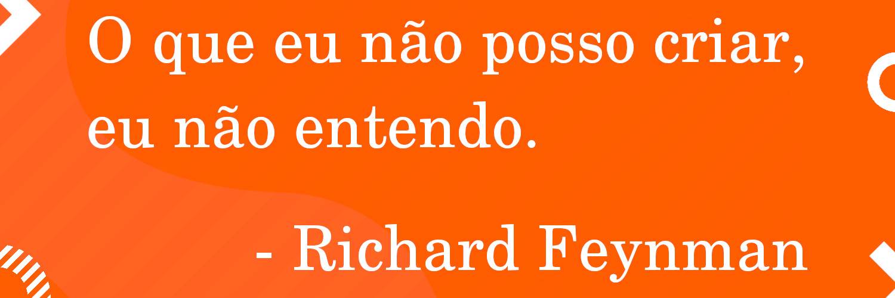

# Olá pessoas, eu sou o Eduardo e esse é o meu GitHub!

- :bar_chart: Licenciado em Matemática.
- :computer: Programador.
- :nerd_face: Nerd.
- :telescope: Apaixonado por ciência e tecnologia.
- :blue_book: Apaixonado em entender como as coisas funcionam por baixo dos panos.
- :: Procurando colocação como desenvolvedor.

## Tecnologias

- Estudando **Node** e **ReactJS** além de um pouquinho de **React-Native** com **Expo**.

- Trabalhei com **Python** em projetos pessoais de *web scrap*, além de usar suas fantásticas bibliotecas científicas para simulações de pesquisas por amostragem, e resolução de problemas variacionais utilizando o método de **Rayleigh-Ritz** no meu [tcc](https://eduardojm.github.io/tcc/). 

## Se conecte comigo em outros lugares:

